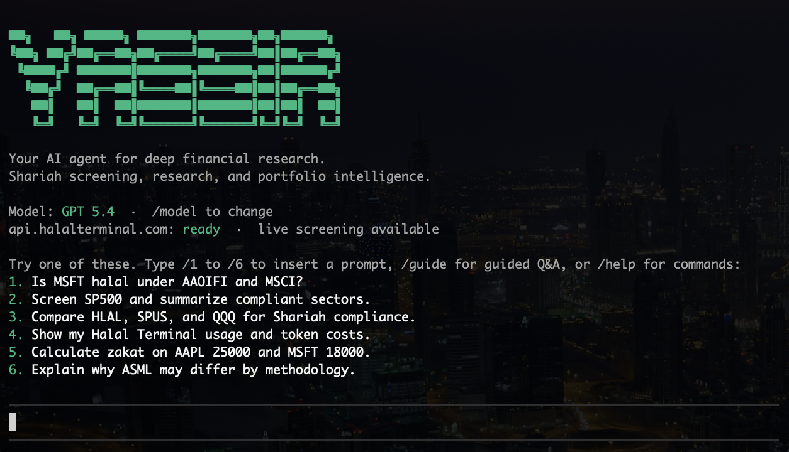
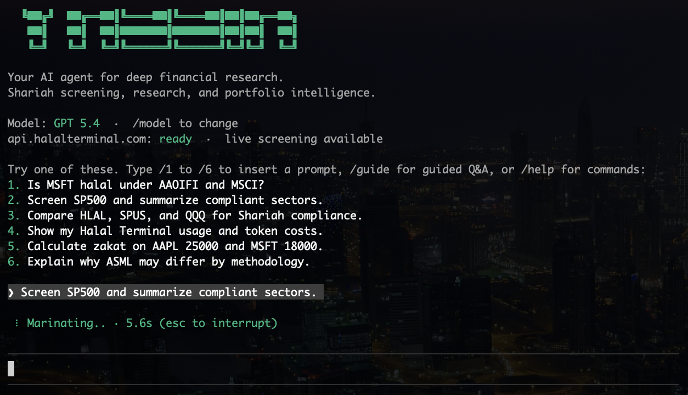

<p align="center">
  <h1 align="center">Yassir</h1>
  <p align="center">
    <strong>Open-source AI agent for financial research and Shariah-compliant investing.</strong>
  </p>
  <p align="center">
    Ask complex financial questions. Yassir plans the research, calls the right tools, and delivers decision-ready answers with HalalTerminal-first evidence.
  </p>
</p>

<p align="center">
  <a href="LICENSE"></a>
  <a href="https://bun.sh"></a>
  <a href="https://www.typescriptlang.org"></a>
  <a href="https://hub.docker.com"></a>
  <a href="https://api.halalterminal.com"></a>
</p>

<p align="center">
  <a href="#quickstart">Quickstart</a>&nbsp;&nbsp;|&nbsp;&nbsp;
  <a href="#what-can-yassir-do">What it does</a>&nbsp;&nbsp;|&nbsp;&nbsp;
  <a href="#core-workflows">Core Workflows</a>&nbsp;&nbsp;|&nbsp;&nbsp;
  <a href="#shariah-screening">Shariah Screening</a>&nbsp;&nbsp;|&nbsp;&nbsp;
  <a href="#for-ai-agents">For AI Agents</a>&nbsp;&nbsp;|&nbsp;&nbsp;
  <a href="#llm-providers">LLM Providers</a>&nbsp;&nbsp;|&nbsp;&nbsp;
  <a href="#self-hosting">Self-hosting</a>&nbsp;&nbsp;|&nbsp;&nbsp;
  <a href="CONTRIBUTING.md">Contributing</a>
</p>

<p align="center">
  
</p>

<p align="center">
  
</p>

---

## Why Yassir?

Most financial AI tools are either closed-source, limited to chat, or lack real data access. Yassir is different:

- **Autonomous research** -- Ask a question, Yassir builds a plan, calls the right tools in sequence, and synthesizes a sourced answer. No manual prompt chaining.
- **Real data, not hallucinations** -- Pulls from HalalTerminal, SEC EDGAR/open-data tools, and web search fallback. Every important claim can be grounded in tool output.
- **Shariah-first** -- Built around Shariah screening, portfolio audit, purification, watchlist monitoring, and halal replacement workflows.
- **CLI first, web second** -- The terminal is the primary product surface. The web UI is a companion interface for the same workflows.
- **Your LLM, your data** -- Runs locally or self-hosted. Supports OpenAI, Anthropic, Google, xAI, DeepSeek, OpenRouter, Moonshot, and Ollama.
- **Built for developers** -- TypeScript, Apache-2.0 licensed, extensible tool system, and clear product boundaries around HalalTerminal.

---

## Quickstart

### 1. Install

```bash
git clone https://github.com/goww7/yassir-oss.git
cd yassir-oss
bun install
cp env.example .env
```

Add two keys to `.env`:

```env
OPENAI_API_KEY=sk-proj-...
HALAL_TERMINAL_API_KEY=ht_...
```

Get a free HalalTerminal key from [api.halalterminal.com](https://api.halalterminal.com).

### 2. Run the CLI

```bash
bun dev
```

### 3. Run the web app

```bash
bun run web:install
bun run web:dev
bun run web:ui
```

- API server: `http://localhost:3000`
- Web UI: `http://localhost:5173`

For hosted web access, set `YASSIR_ACCESS_CODE` before exposing the app.

### 4. Try these queries

```text
> Is Apple Shariah-compliant? Show the full screening breakdown.

> /audit AAPL MSFT SPUS

> /purification AAPL MSFT

> /ideas replace QQQ with halal alternatives

> What did Tesla report in their latest 10-K filing? Summarize the risk factors.
```

### Or use Docker

```bash
git clone https://github.com/goww7/yassir-oss.git && cd yassir-oss
cp env.example .env
docker compose up --build
```

Web API at `http://localhost:3000`.

### For AI agents

Yassir includes LLM-friendly project context:

- [`llms.txt`](llms.txt) for quick AI discovery and repository orientation
- [`AGENTS.md`](AGENTS.md) for coding-agent guidance
- [`docs/examples.md`](docs/examples.md) for copy-paste research prompts

### What users need

- An LLM key, usually `OPENAI_API_KEY`
- A HalalTerminal key, `HALAL_TERMINAL_API_KEY`
- Optional search key for richer fallback research

Everything else is optional. Yassir will route between HalalTerminal, SEC/open data, web search, and local workspace tools automatically.

---

## What can Yassir do?

Yassir runs a **ReAct agent loop**: it plans research steps, executes tools, observes results, and iterates until it has a complete answer.

### Tools

| Tool | Description |
|------|-------------|
| `get_shariah` | HalalTerminal-powered Shariah screening, audits, purification, watchlists, quota, and plans |
| `get_financials` | HalalTerminal asset profiles, database records, quotes, dividend history, and SEC XBRL facts |
| `get_market_data` | HalalTerminal stock quotes, OHLC history, batch quotes, trending assets, and news |
| `read_filings` | Extract and analyze SEC 10-K/10-Q filings |
| `stock_screener` | HalalTerminal database search by ticker, name, sector, country, exchange, or asset type |
| `web_search` | Federated search across Exa, Tavily, Perplexity, and Brave |
| `x_search` | X/Twitter sentiment and market chatter |
| `sec_company_facts` | SEC EDGAR structured company data |
| `sec_submissions` | SEC filing history and submission metadata |
| `browser` | Playwright automation for JS-rendered pages |
| `memory_*` | Persistent memory across sessions |
| `skill` | Specialist Shariah workflows and other dynamic skills |
| `read_file` / `write_file` | Workspace file operations |

### Agent features

- **Research planning** -- generates a focused plan before deep work
- **Progress synthesis** -- periodic "so far" updates during long runs
- **Context management** -- automatic clearing when context fills, with scratchpad retrieval
- **Persistent memory** -- remembers facts across sessions
- **Tool approval** -- asks before executing sensitive operations
- **Quota-aware behavior** -- if upstream screening is unavailable, Yassir marks the result as unresolved instead of overstating certainty

---

## Core Workflows

Yassir is organized around explicit Shariah-investing workflows instead of a generic multi-profile UX.

### Single Asset Review

```text
/screen MSFT
/brief HLAL
```

Outputs:
- Verdict
- Methodology Breakdown
- Key Reasons
- Purification
- Next Checks

### Portfolio Audit

```text
/audit AAPL MSFT SPUS
/portfolio AAPL AMZN TSLA
```

Outputs:
- Portfolio Verdict
- Compliant / At Risk / Unresolved Holdings
- Concentration Risks
- Recommended Actions

### Purification Planner

```text
/purification AAPL MSFT
```

Outputs:
- Available purification data
- Uncertainty and missing inputs
- What to track next

### Watchlist Monitoring

```text
/monitor wl_123
/monitor AAPL MSFT HLAL
```

Outputs:
- Compliance drift
- Material events
- Re-screen priorities

### Replacement Ideas

```text
/ideas replace QQQ with halal alternatives
```

Outputs:
- Target exposure
- Screened replacement candidates
- Trade-offs and caveats

### Guided Workflows

Use `/guide` to open guided Shariah workflows in CLI or web.

Available flows:
- Single-Asset Review
- Portfolio Audit
- Purification Planner
- Watchlist Monitor
- Replacement Ideas

---

## Shariah Screening

Yassir is powered by [HalalTerminal](https://api.halalterminal.com) for Shariah compliance data and Islamic finance workflows.

**Get your API key** at **[api.halalterminal.com](https://api.halalterminal.com)**.

### What's included

- Stock and ETF Shariah screening
- Portfolio scans and audits
- Bulk index screening
- Purification workflows
- Watchlist management and monitoring
- Usage, quota, and plan checks

### Source order

Yassir follows this source order:

1. HalalTerminal structured domain data
2. Finance and open-data tools
3. SEC and issuer disclosures where relevant
4. Web search only as fallback or supporting context

### Quota handling

If upstream screening is unavailable:

- Yassir marks the result as unresolved
- avoids presenting blocked or partial screening as authoritative
- asks the user to retry once screening access is available again

---

## Commands

```text
/screen <symbol>
/compare <a> <b> [c d e]
/portfolio <symbols...>
/audit <symbols...>
/purification <symbols...>
/bulk <index>
/report <symbol>
/brief <symbol>
/monitor <watchlist|symbols...>
/ideas <symbol|theme>
/watchlist list
/watchlist create <name>: <symbols...>
/usage
/guide
/workspace
/attach
/keys
/doctor
```

---

## LLM Providers

Use any provider and switch at runtime with `/model`.

| Provider | Environment Variable | Notes |
|----------|---------------------|-------|
| **OpenAI** | `OPENAI_API_KEY` | Default |
| **Anthropic** | `ANTHROPIC_API_KEY` | Claude models |
| **Google** | `GOOGLE_API_KEY` | Gemini models |
| **xAI** | `XAI_API_KEY` | Grok models |
| **DeepSeek** | `DEEPSEEK_API_KEY` | Cost-effective alternative |
| **OpenRouter** | `OPENROUTER_API_KEY` | Access many models through one key |
| **Moonshot** | `MOONSHOT_API_KEY` | |
| **Ollama** | `OLLAMA_BASE_URL` | Local models |

---

## Self-hosting

Yassir is designed to be self-hosted.

```yaml
services:
  yassir:
    build: .
    ports:
      - "3000:3000"
    env_file: .env
    volumes:
      - yassir-data:/app/.yassir
      - yassir-agents:/app/.agents
```

Set `YASSIR_ACCESS_CODE` in `.env` to protect the web UI when hosting it.

### Public Deployment Checklist

- Set `YASSIR_ACCESS_CODE` to a strong shared access code.
- Put Yassir behind HTTPS with a reverse proxy.
- Keep `.env` out of git and rotate keys if exposed.
- Mount `.agents` and `.yassir` as persistent volumes.
- Start with trusted users before opening public signups.
- Review uploaded workspace files before sharing an instance with untrusted users.

---

## Configuration

### Required

- `OPENAI_API_KEY` or another supported LLM key
- `HALAL_TERMINAL_API_KEY`

### Recommended

- `YASSIR_ACCESS_CODE` for hosted web UI protection
- one search provider for richer fallback research:
  - `BRAVE_SEARCH_API_KEY`
  - `EXASEARCH_API_KEY`
  - `TAVILY_API_KEY`
  - `PERPLEXITY_API_KEY`
  - `X_BEARER_TOKEN` for X/Twitter context

### Agent tuning

- `YASSIR_DEFAULT_MODEL`
- `YASSIR_DEFAULT_PROVIDER`
- `YASSIR_MAX_ITERATIONS`

---

## Project Structure

```text
src/
  agent/               ReAct loop, prompt policy, scratchpad, progress
  integrations/        HalalTerminal integration boundary
  profile/             Product profile and guided workflow definitions
  skills/              Specialist Shariah workflows
  tools/finance/       HalalTerminal, market, financials, filings
  web/                 Hono API server
web/
  src/                 React companion UI
```

---

## Development

```bash
bun run typecheck
bun test
```

If you touch the web UI:

```bash
bun run web:install
bun run web:build
```

## Contributing

See [CONTRIBUTING.md](CONTRIBUTING.md).

## License

[Apache License 2.0](LICENSE). See [NOTICE](NOTICE) for HalalTerminal attribution.

---

<p align="center">
  Built with <a href="https://api.halalterminal.com">HalalTerminal</a>
</p>
